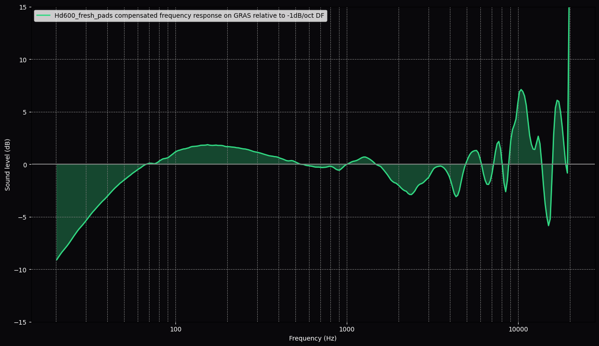
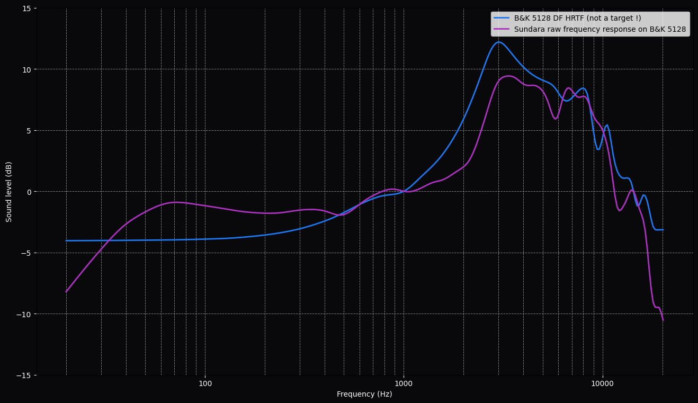

**This is a work in progress !** 

## Introduction
This is a small project to help visualize the headphone transfer function (HpTF) effects using measurements from the B&K 5128 HATS and GRAS system (KB50xx).  
If you notice any calculation error, please don't hesitate to open an issue ! Thank you in advance.

## Screenshots:
  
  
  
  