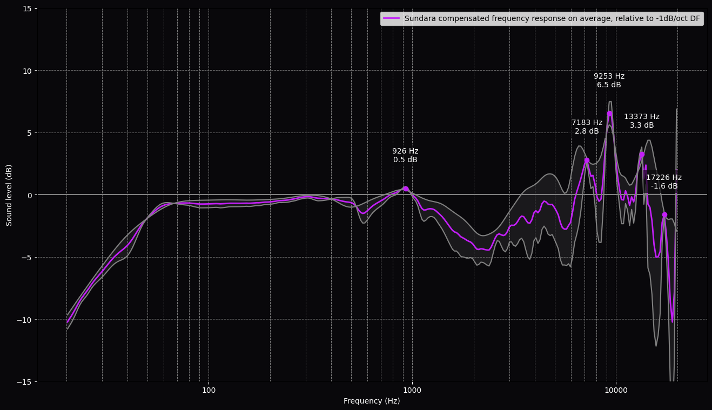

**This is a work in progress !** 

## Introduction
This small project visualizes the headphone transfer function (HpTF) variations using measurements from the B&K 5128 HATS and GRAS KB50xx systems. The HpTF delta between these rigs shows how much the frequency response may vary between individuals. A tighter error on the plot suggests the response is closer to what you actually hear, highlighting areas to adjust with EQ if something sounds off. **Low HpTF variation means easier to EQ.**  
If you notice any calculation error, please don't hesitate to open an issue ! Thank you in advance.  
Frequency responses from Squiglink.

## Examples:
Lower HpTF variation is better.  
### Good HpTF variation:

  
  
HD800S is known to have a low HpTF variation from bass to high mids due to its low acoustic output impedance relative to other headphones. Treble however, can vary quite a lot from person to person.

### Bad HpTF variation:

  
  
ATH-M50x frequency response varies across the whole frequency range.

## Screenshots:

  
  
  

